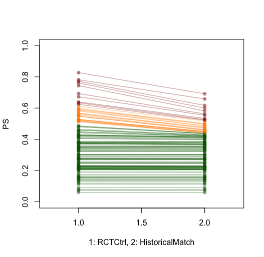

# ALS-RWD-Hybrid-Design
The R-package that generated results for the Hybrid Design Paper

```r
install_github("CISD-Stanford/ALSRWDHybridDesign")
library("ALSRWDHybridDesign")

EligiblePatients (Registry = Registry, inclusion = list("AGE >= 18", "AGE < 64"), exclusion = "DISDUR > 36")
EligiblePatients (Registry = Registry, exclusion = "DISDUR > 36", rm.na = T)
EligiblePatients (Registry = Registry, summary = T)

get.Matched (formula = as.formula (GRP ~ log (DISDUR) + as.factor(SEX) + BMI), data.registry, data.rct, method = "nearest", ratio = 1, distance = "glm", id.var = "ID", stime.var = "STIME_Death", status.var = "STATUS_Death", alpha = 0.2, plot = F)
get.Matched (formula = as.formula (GRP ~ log (DISDUR) + BMI), Registry = Registry, data.registry, data.rct, plot = "dist")
```



### Citing `HistoricalMatching`

Please cite `HistoricalMatching` when using it for analysis presented in publications, which you can do by citing the article below:
Ruben P.A. van Eijk et al. Hybrid controlled clinical trials using concurrent registries in Amyotrophic Lateral Sclerosis: A feasibility study. 
